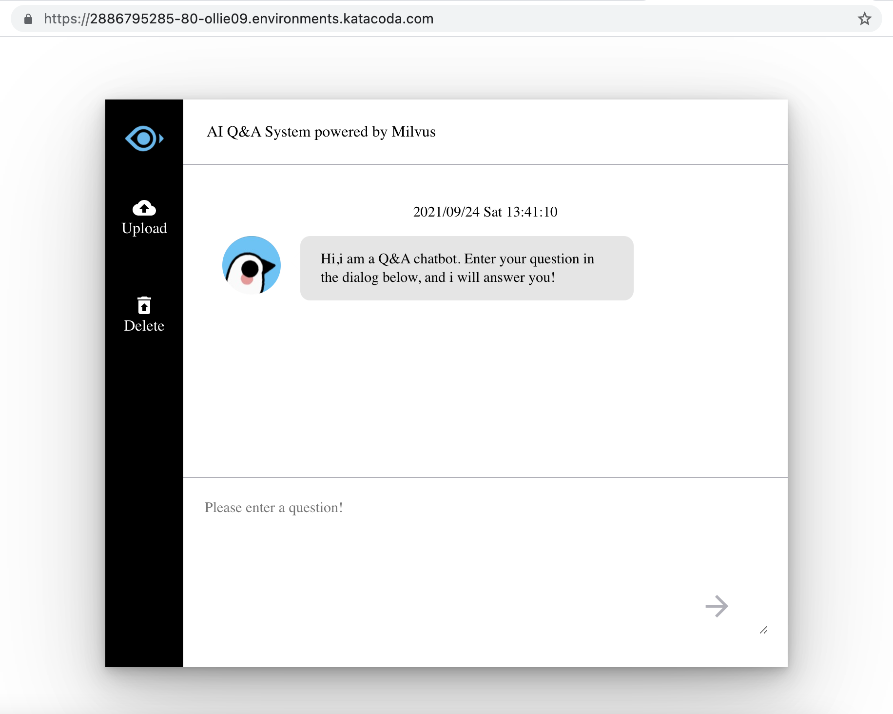

### 4. Launch a browser

Click `+` to the right of the `Terminal`, then View HTTP port 80 on Host 1 to show the interface.

## How to use
- Initial interface

- Load data
  - Click `upload` button and select a csv file from local (you can get sample csv file from Step 2)
  - If using a customized csv file, please refer the sample file for data format.
  - After data is successfully loaded, you will see a number of data.

- Retreve similar questions
  - Enter your question in the dialog
  - You will get 5 most similar questions in the dataset.

- Obtain answers
  - Click any of the similar questions from "Retrieve similar questions".
  - You will get answers stored in dataset.
